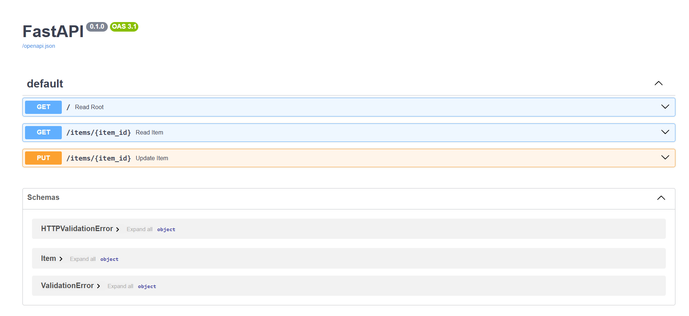
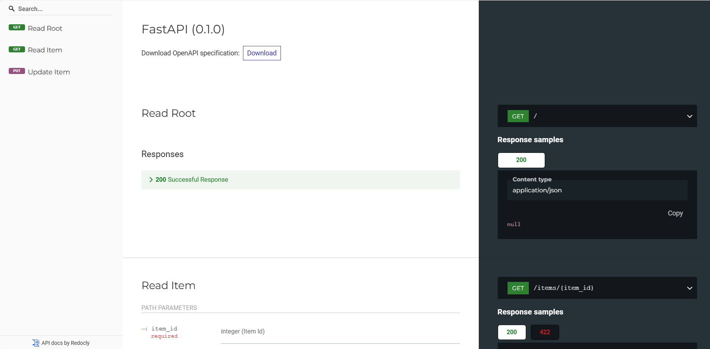

# api-sample-with-fast-api
API playground

## Description

- This repo uses Fast API lib to build a simple API in 5 min.
- It can be used to test, experiment and play with API development

## How to run?

Open a python terminal and run the following 2 commands:

````
pip install "fastapi[standard]"

fastapi dev main.py

http://127.0.0.1:8000/docs
http://127.0.0.1:8000/redoc
````

## Screenshots





## References

- https://fastapi.tiangolo.com/
- https://github.com/fastapi/fastapi